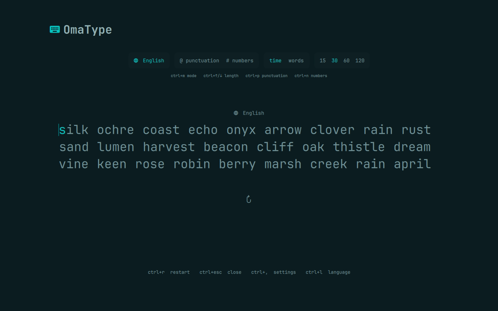

<div align="center">

# OmaType

**Offline typing practice, built into Omarchy.**

Timed and word tests in a focused interface that follows your active theme—without an account, telemetry, or network access.



</div>

## Why OmaType

- **It feels at home.** The full-screen interface uses your active Omarchy colors and typography, while a compact bar widget keeps your latest WPM close by.
- **It stays out of the way.** Focus mode clears the surrounding interface once you begin. Everything from setup to settings has a keyboard-only path.
- **Your data stays yours.** Tests, preferences, and history remain on your machine. There is no account, cloud service, or network dependency.

### Practice your way

- Run **15, 30, 60, or 120-second** tests.
- Choose **10, 25, 50, or 100-word** tests.
- Add punctuation and numbers to English prompts.
- Practice English or one of **36 programming-language vocabularies**, including Bash, Nix, Python, Rust, JavaScript, TypeScript, C/C++, Go, SQL, Swift, Zig, and more.
- Review WPM, raw WPM, accuracy, consistency, character counts, and a second-by-second speed chart.
- Tune the caret, timer, live metrics, typography, line geometry, focus behavior, motion, contrast, and error indicators.

English prompts are generated from OmaType's original 229-word offline corpus. Programming packs contain original, project-curated keywords, operators, syntax terms, and common API identifiers.

## Install

OmaType requires an Omarchy installation using the Quattro shell.

```sh
omarchy plugin add https://github.com/OldJobobo/omatype.git --enable
```

Once enabled, select **OmaType** from the bar and begin typing. You can also open it directly:

```sh
omarchy-shell shell toggle jobo.omatype '{}'
```

For a pointer-free launch, assign that command to an available shortcut through your normal Omarchy/Hyprland keybinding configuration. OmaType intentionally does not claim a global key during installation.

## Controls

### While typing

| Action | Shortcut |
| --- | --- |
| Start a test | Type any printable character |
| Repair the previous character | `Backspace` |
| Start a fresh test | `Ctrl+R` |
| Switch between time and word modes | `Ctrl+M` |
| Change the test length | `Ctrl+Up` / `Ctrl+Down` |
| Toggle punctuation | `Ctrl+P` |
| Toggle numbers | `Ctrl+N` |
| Choose a language | `Ctrl+L` |
| Open settings | `Ctrl+,` |
| Close OmaType | `Ctrl+Escape` |

`Enter` starts the next test from the results screen and can optionally end an active test early. The quick-restart key can be set to `Tab`, `Escape`, `Enter`, or disabled; `Ctrl+R` always works.

### Panels and settings

- Use `Arrow` keys or `Tab` / `Shift+Tab` to move through controls.
- In the language picker, `Home/End` jumps to either boundary and `Page Up/Page Down` moves through the list faster. Press `Enter` or `Space` to select.
- In settings, use `Ctrl+1` through `Ctrl+5` or `Ctrl+Left` / `Ctrl+Right` to switch between **Test**, **Behavior**, **Display**, **Caret**, and **Access**.
- Left/Right changes the focused value, `Enter` / `Space` advances it, and `R` resets the current section. `Home/End` jumps to the first or last settings row; `Page Up/Page Down` scrolls the drawer.
- Plain `Escape` closes an open panel first. Otherwise, it follows your quick-restart preference or closes the overlay. `Ctrl+Escape` always closes OmaType.

Programming vocabularies preserve syntax tokens as written, so English punctuation and number transformations are unavailable while a programming language is selected.

## Local by design

OmaType does not use the network, read credentials, request elevated privileges, invoke a package manager, or modify unrelated user configuration.

| Data | Location |
| --- | --- |
| Preferences | `~/.config/omarchy/omatype-settings.json` |
| Latest 100 test results | `~/.local/state/omarchy/omatype-history.json` |

Preferences are versioned and validated before use. A test snapshots its active behavior and setup preferences when it begins, so mid-test changes cannot alter the run already in progress.

> [!IMPORTANT]
> Like all Quattro plugins, OmaType runs unsandboxed inside `omarchy-shell` with your current user permissions. OmaType uses that access only for the local files above and the host-shell command that opens or closes its interface.

## Remove

```sh
omarchy plugin remove jobo.omatype
```

Removing the plugin leaves your preferences and history intact. To erase them as well, delete the two local files listed above after uninstalling.

<details>
<summary><strong>Local development</strong></summary>

### Link a checkout

```sh
mkdir -p ~/.config/omarchy/plugins
ln -s /absolute/path/to/omatype ~/.config/omarchy/plugins/jobo.omatype
omarchy plugin validate ~/.config/omarchy/plugins/jobo.omatype
omarchy plugin enable jobo.omatype right
omarchy-restart-shell
```

### Validate changes

Node.js 20 or newer is required for the development test suite. There are no npm dependencies.

```sh
tests/run
node -e 'for (const f of ["manifest.json", "data/words-en.json"]) JSON.parse(require("node:fs").readFileSync(f))'
git diff --check
```

QML runtime validation requires Qt 6, Quickshell, and the Quattro plugin host. Contract tests keep deterministic business logic testable without a compositor.

### Project structure

| Path | Purpose |
| --- | --- |
| `manifest.json` | Quattro schema-v1 plugin manifest |
| `OmaType.qml` | Full-screen overlay entry point |
| `BarWidget.qml` | Bar widget entry point |
| `src/` | Generator, typing state, metrics, sessions, history, settings, layout, and language registry |
| `data/words-en.json` | Original English word corpus |
| `tests/` | Dependency-free Node tests and QML contract checks |

The overlay owns a full-screen `PanelWindow` and exclusive typing focus. Quattro keeps the plugin instance alive and calls `open(payloadJson)` and `close()`. The bar widget follows the supported `BarIconButton` contract and uses `bar.run(...)` to toggle `jobo.omatype` through `omarchy-shell`.

</details>

## License

OmaType is original, MIT-licensed software. It takes visual cues from the calm, distraction-free category of typing trainers without copying Monkeytype code, word data, or assets. See [LICENSE](LICENSE).
